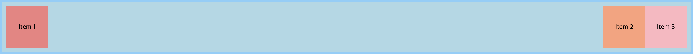

# Align items with auto margins



위 사진과 같이 왼쪽 끝에 2개, 오른쪽 끝에 1개의 아이템을 Flexbox를 이용하여 정렬해야 할 경우, 기존에는 왼쪽 끝의 2개의 아이템을 `div`로 묶은 후 `justify-content: space-between`로 정렬하는 방식을 사용하고 있었다.

```html
<head>
  <style>
    .container {
      display: flex;
      justify-content: space-between;
      padding: 10px;
      border: 5px solid lightskyblue;
      background-color: lightblue;
    }

    .left {
      display: flex;
    }

    .item {
      width: 100px;
      height: 100px;
    }

    .item-1 {
      background-color: lightcoral;
    }

    .item-2 {
      background-color: lightsalmon;
    }

    .item-3 {
      background-color: lightpink;
    }
  </style>
</head>
<body>
  <div class="container">
    <div class="left">
      <div class="item item-1">Item 1</div>
      <div class="item item-2">Item 2</div>
    </div>
    <div class="item item-1">Item 3</div>
  </div>
</body>
```

이 방식이 별로라 느꼈던 가장 큰 이유 중 하나는, 스타일링을 위한 목적으로 두 요소를 그룹짓기 위한 `div.left`를 구조만을 담당해야 할 HTML에 추가해야한다는 점이었다. `div.left`가 없더라도 의미를 전달하는 데에는 아무런 문제가 없다.

매우 흔한 형태의 정렬임에도 불구하고, 계속해서 이런 찝찝한 방식을 사용해오고 있었다. 그러다 최근에서야 불필요한 `div`를 만들지 않고도 위와 같은 형태로 정렬할 수 있는 방법을 알게 되었다.

다음과 같은 형태로 Flex 아이템에 **Auto margins** 방식을 적용하면 된다.

```html
<head>
  <style>
    .container {
      display: flex;
      justify-content: space-between;
      padding: 10px;
      border: 5px solid lightskyblue;
      background-color: lightblue;
    }

    .item {
      width: 100px;
      height: 100px;
    }

    .item-1 {
      background-color: lightcoral;
    }

    .item-2 {
      /* margin-right: auto 설정 */
      margin-right: auto;
      background-color: lightsalmon;
    }

    .item-3 {
      /* .item-2에 설정한 `margin-left`를 지우는 대신
         .item-3에 `margin-left: auto` 설정할 수도 있다. */
      /* margin-left: auto; */
      background-color: lightpink;
    }
  </style>
</head>
<body>
  <div class="container">
    <div class="item item-1">Item 1</div>
    <div class="item item-2">Item 2</div>
    <div class="item item-1">Item 3</div>
  </div>
</body>
```

이렇게 Auto magrins 방식이 적용된 Flexbox에는 `justify-content` 속성을 적용하더라도 겉으로 보았을 때 아무런 차이가 없다. 이는 Auto margin 설정으로 인해 여백의 공간이 모두 margin 영역으로 빼곡히 채워짐으로 인한 것이다.

## 참고

* [Quick Tip: How z-index and Auto Margins Work in Flexbox - sitepoint](https://www.sitepoint.com/quick-tip-how-z-index-and-auto-margins-work-in-flexbox/)
