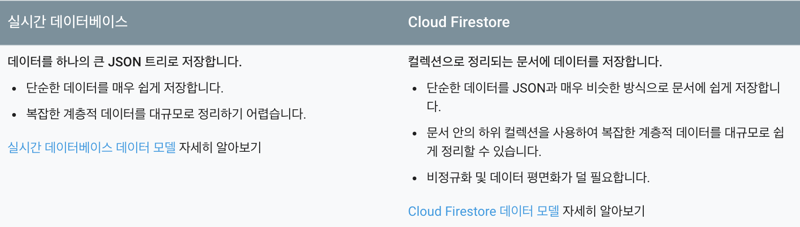

# Firestore DB 모델링

이전까지 쭈욱 Realtime DB만 사용해오다가, 현재 진행하고 있는 프로젝트에 Firestore를 사용해보기로 했다. 아직 베타 버전이라는 점만 제외하고 모든 면에서 Realtime DB보다 좋아보였기 때문이다. 기본적으로 둘 다 Nosql 형식이기 때문에 DB 구조도 비슷한 방식으로 모델링하면 될 것 같았고, 실제로도 분명 비슷하긴 했는데 몇 가지 고민되는 부분이 있었기 때문에 그 부분에 대해서 가볍게 정리해보려 한다.

## Firestore 데이터 구조화하기

Firestore에서 데이터를 구조화하는 방법은 크게 다음 세 가지가 있다.

### 1. 문서의 중첩 데이터(Embedded data)

문서 자체에 중첩 개체를 사용하여 데이터를 저장한다. 중첩 개체의 속성 값에 기반한 쿼리가 가능하다.

### 2. 하위 컬렉션(Subcollections)

특정 문서에 중첩된 하위 컬렉션을 정의하여 데이터를 저장한다.

### 3. 루트 수준 컬렉션(Root collections)

루트 수준에 특정 타입을 갖는 모든 문서를 저장한다. 쿼리의 유연성이 뛰어나다.

## Realtime DB처럼 Firestore에도 비정규화 작업이 필요할까

Realtime DB에서 데이터 모델링 작업을 할 때는 데이터 중첩이 깊어지는 것을 피하고, 특정 참조에 대해서 불필요한 데이터가 함께 불러와지는 경우를 예방하기 위해, 루트 수준에서 형제 노드에 관한 참조를 저장하는 방식으로 데이터 평면화 작업이 필요했다. 그런데 Firestore에서 하위 컬렉션 방식을 사용하여 데이터를 중첩 저장하게 되면, 해당 문서를 참조하더라도 하위 컬렉션으로 정의한 데이터는 함께 불러와지지는 않기 때문에 비정규화에 대한 고민을 이전보다 많이 덜 수 있었다.

그런데 바로 이 부분에서 또 다른 고민이 생겼다. **Firestore DB 모델링에서는 비정규화 작업이 전혀 필요하지 않은걸까?** 하위 컬렉션을 사용하여 데이터를 중첩 저장할 수 있다곤하지만, 데이터를 깊게 중첩해나가는 방식에 대해서 아무런 문제가 없을 것이라는 확신이 서지 않았다.

이런 이유로, 공식 문서에서 Realtime DB와 Firestore를 비교해놓은 내용을 다시 한번 확인해보았다.

**"Firestore: 비정규화 및 데이터 평면화가 덜 필요합니다."**

문서에서는 분명 Firestore DB 모델링 작업을 할 때 비정규화 및 데이터 평면화가 **아예 필요하지 않은 게 아니라 덜 필요**하다고 이야기하고 있다. 그렇다면 어느 시점에서 어떤 기준을 적용하여 비정규화 작업을 진행하면 좋은 것일까?

기준을 적용하기 위해서 스스로에게 다음 세 가지 질문을 던져보면 된다.

### 1. 특정 컬렉션이 언제나 부모 문서 내에 한정하여 쿼리되는가(Will you ALWAYS query the collection scoped to its parent document)?

이 질문에 대한 답이 '예(Yes)'라면, 하위 컬렉션(Subcollections) 방식을 적용하면 된다. 하위 컬렉션은 다수의 문서 간에 병합되어질 필요가 없는 데이터인 경우에 유용하다.

### 2. 데이터 최대 크기가 1MB를 초과하지 않는가(Is the max data size less than ~1MB)?

이 질문에 대한 답이 '예(Yes)'라면, 중첩 데이터(Embedded data) 방식을 적용하자. 데이터 크기가 작고 단순하다면, 중첩 데이터 방식이 이상적이다.

### 3. 부모를 횡단하여 데이터를 쿼리헤야할 경우가 있는가(Do you need to query documents across their parents)?

이 질문에 대한 답이 '예(Yes)'라면, 루트 수준 컬렉션(Root collections) 방식을 적용하자. 예를 들어, 트윗이 한 사용자에게 속하는 동시에 특정 날짜에 대한 모든 유저로부터의 트윗을 불러오길 원한다면, 루트 수준 컬랙션이 적절할 것이다.
