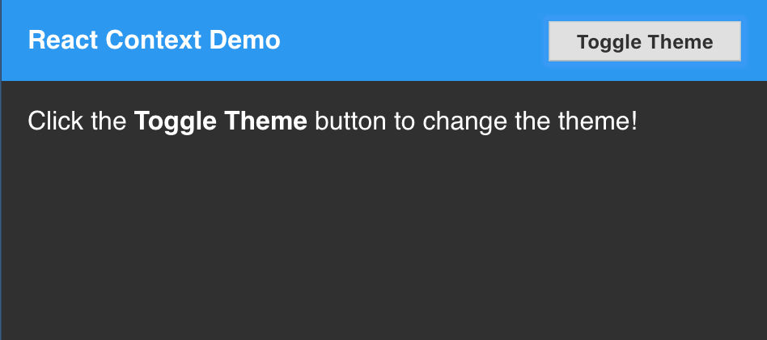

React Context Demo
==================
This example shows how to use the new [React Context API](https://reactjs.org/docs/context.html).



Getting Started
---------------
```bash
$ yarn install
$ yarn start
```

Now point your browser to http://localhost:3000/.
