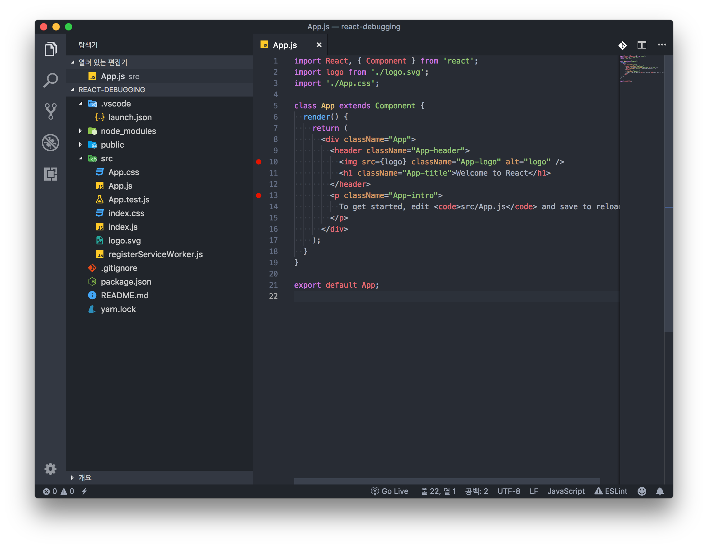
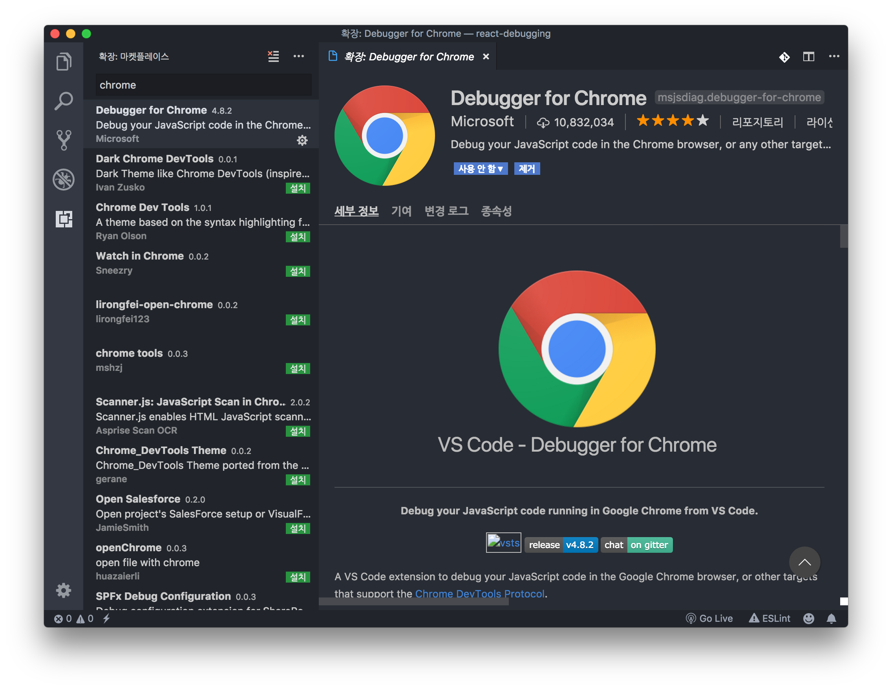
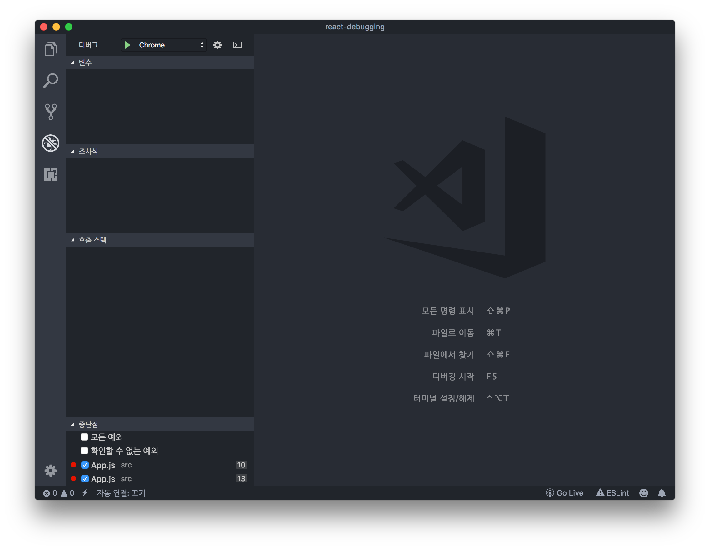

# VSCode에서 Create React App 프로젝트 디버깅하기

## 리액트 코드 디버깅하기

터미널에서 `yarn start`로 개발 서버를 실행한다.

```bash
yarn start
```

코드의 실행을 일시 중지하고 싶은 위치에 중단점을 체크한다.



마켓플레이스에서 Debugger for Chrome 익스텐션을 설치한 다음 리로드한다.



크롬 디버깅 실행 스크립트를 설정해야 한다. 디버깅 패널로 이동하여 톱니바퀴 아이콘을 누른 다음 Chrome을 선택한다.



[Create React App](https://github.com/facebook/create-react-app/blob/master/packages/react-scripts/template/README.md#visual-studio-code)에서 안내하는 지시에 따라 `launch.json`을 다음과 같이 수정한다.

```json
{
  "version": "0.2.0",
  "configurations": [{
    "name": "Chrome",
    "type": "chrome",
    "request": "launch",
    "url": "http://localhost:3000",
    "webRoot": "${workspaceRoot}/src",
    "sourceMapPathOverrides": {
      "webpack:///src/*": "${webRoot}/*"
    }
  }]
}
```

여기까지 문제없이 잘 마쳤다면, 디버깅 패널 상단 선택 창이 `Chrome`으로 잘 선택되었는지 확인 후 녹색 화살표를 클릭하여 디버깅용 크롬 브라우저를 실행할 수 있다. 미리 설정해놓은 각 중단점 위치에서의 지역 및 전역 변수, this가 참조하고 있는 값, 호출 스택 등을 확인할 수 있다.

## 테스트 코드 디버깅하기

불행하게도, 앞 단계에서 설정한 실행 스크립트 설정은 테스트 코드엔 적용되지 않는다. 이 문제를 해결하기 위해 Create React App 공식 문서에서 안내하고 있는 방법에 따라 실행 스크립트 설정을 추가해야 한다. 최종적으로 아래와 같은 형식이 되어야 한다.

```json
{
  "version": "0.2.0",
  "configurations": [
    {
      "name": "Chrome",
      "type": "chrome",
      "request": "launch",
      "url": "http://localhost:3000",
      "webRoot": "${workspaceRoot}/src",
      "sourceMapPathOverrides": {
        "webpack:///src/*": "${webRoot}/*"
      }
    },
    {
      "name": "Debug CRA Tests",
      "type": "node",
      "request": "launch",
      "runtimeExecutable": "${workspaceRoot}/node_modules/.bin/react-scripts",      
      "args": [
        "test",
        "--runInBand",
        "--no-cache",
        "--env=jsdom"
      ],
      "cwd": "${workspaceRoot}",
      "protocol": "inspector",
      "console": "integratedTerminal",
      "internalConsoleOptions": "neverOpen"
    }
  ]
}
```

이제, 디버깅 패널 상단 선택 창을 `Debug CRA Tests`로 변경한 다음 녹색 화살표를 클릭하면 테스트 코드 디버깅을 실행할 수 있다.